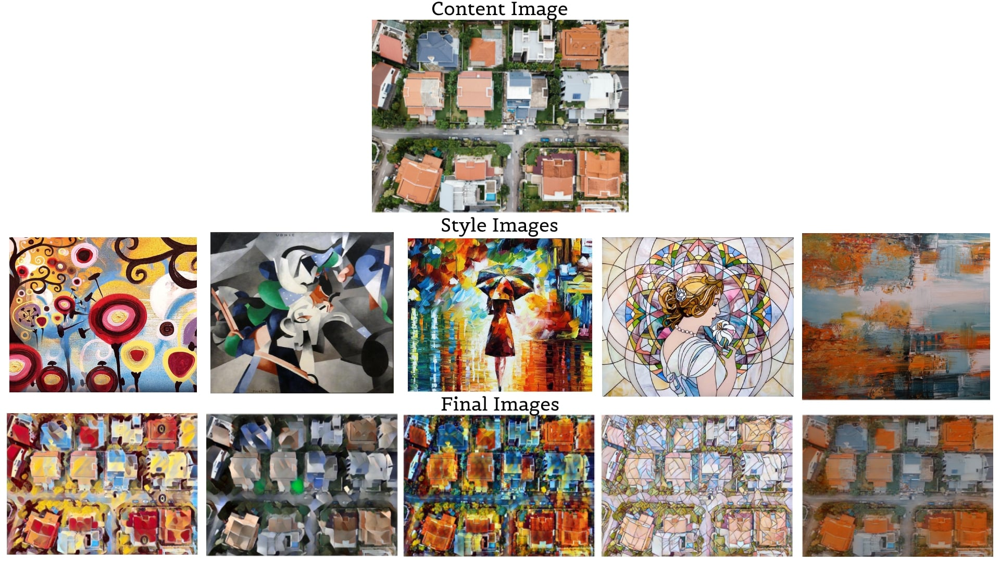

# Neural-Style-Transfer-using-Streamlit

Try it out : [https://neural-sty1e-transfer.herokuapp.com](https://neural-sty1e-transfer.herokuapp.com/)

## Overview

Neural style transfer is an optimization technique used to take two images—a content image
and a style reference image (such as an artwork by a famous painter)—and blend them
together so the output image looks like the content image, but “painted” in the style of the
style reference image. 

This project is implemented in PyTorch (Python Framework) and deployed on Heroku using Streamlit.
